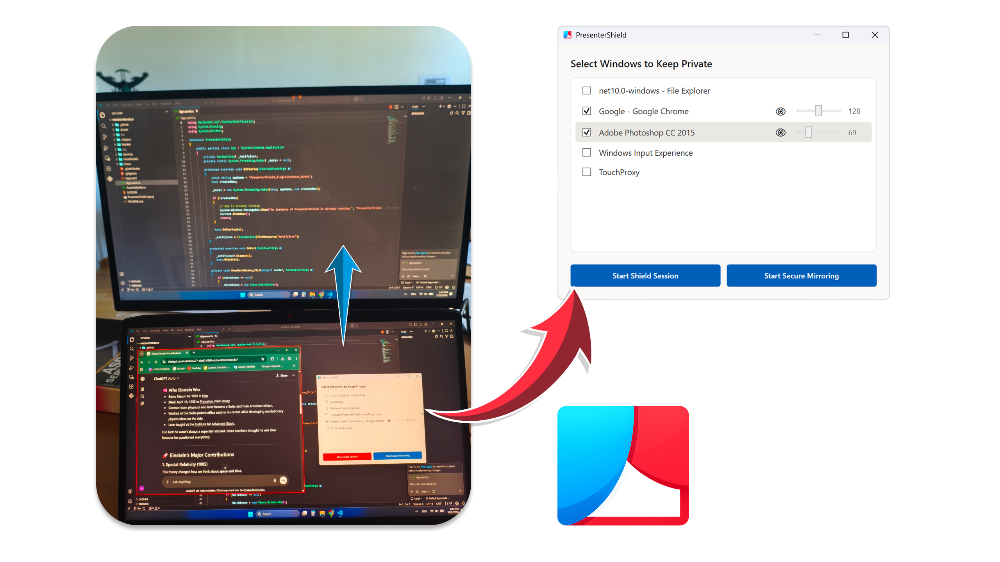

# PresenterShield

**A stealthy privacy overlay for live presentations, screen sharing, and streaming.**

---

## 📖 The Story Behind PresenterShield

A lot of times I wanted to demonstrate as a TA some code walkthroughs, or I had a presentation in PDF, and I couldn't easily have my presenter notes open without exposing them to the audience when sharing my entire screen.

When presenting via HDMI, screen share (Zoom, Teams, Meet), or a projector, you usually have two less-than-ideal options: share everything (and let the audience see your private notes) or use complex setups like OBS and manually switch sources mid-presentation. Neither is acceptable for a natural teaching or presenting workflow.

So, I built **PresenterShield**.

### 🛡️ Operational Modes
PresenterShield handles two main scenarios:

1. **Basic Shielding (Start Shield Session)**: Best for remote meetings (Zoom, Teams, Slack). It applies the privacy overlay directly to your windows. Since these apps capture the "Window" or "Desktop" pipelines, the shellcode-injected affinity flags keep your private windows hidden.
2. **Hardware Mirroring (Start Secure Mirroring)**: Required when connecting to physical outputs like **HDMI, DisplayPort, or Projectors**. Direct hardware outputs often bypass standard window capture flags. In this mode, PresenterShield mirrors your primary display into a dedicated window. **Note: For this to work, your Windows Projection settings must be set to "Extend", not "Duplicate".**

### 🔴 Visual Awareness
Private windows are automatically highlighted with a **subtle red border**. This gives you immediate visual feedback on what is being shielded from the audience, even if you have the opacity set to 100%.

### 💾 Persistent Privacy
The app remembers your choices. Once you mark a window title as private, PresenterShield will automatically apply the shield and border the next time you open that application.

---

## 🛠️ Architecture & Under the Hood

The project is built using **C#** and **WPF** on **.NET 10.0**, leveraging `CommunityToolkit.Mvvm` for clean separation.

### Core Technical Mechanisms
These mechanisms work together to ensure privacy without breaking the user experience:

1. Windows must be **invisible to all capture pipelines** (HDMI out, screen share, OBS).
2. Windows must remain **fully interactive** regardless of where the user clicks.
3. Windows must **never drop behind** other windows or flash on the public view during focus changes.

A naive approach would solve one and break the others. PresenterShield keeps all three intact by combining the following mechanisms:

**1. Hiding from Capture via Shellcode Injection**

`SetWindowDisplayAffinity` with the `WDA_EXCLUDEFROMCAPTURE` flag makes a window invisible to any capture mechanism. However, Windows strictly requires this API to be called *from within the process that owns the window*. To bypass this, `ShellcodeInjector.cs` injects x64 assembler shellcode directly into the target process's memory via `VirtualAllocEx` and `CreateRemoteThread`, forcing the target application to call the API on itself.

**2. Hiding from the Taskbar and Alt-Tab**

By swapping the target window's extended styles (`GWL_EXSTYLE`), removing `WS_EX_APPWINDOW` and applying `WS_EX_TOOLWINDOW`, the window is physically removed from the taskbar and Alt-Tab switcher. This prevents it from accidentally surfacing on the public view during rapid task switching.

**3. The Always-On-Top Interactive Overlay**

`WS_EX_LAYERED` + `SetLayeredWindowAttributes` controls the window's opacity. `SetWindowPos` with `HWND_TOPMOST` ensures it stays above all other windows, so interacting with background apps never pushes the overlay behind. 

**4. DXGI Desktop Duplication (Hardware Mirroring)**

For hardware outputs, standard window affinity flags are bypassed. PresenterShield uses **SharpDX** to interface with the **DXGI Desktop Duplication API**. It captures the primary display at 30+ FPS, filters any "Private" windows out of the texture, and renders the result to a dedicated projection window on the secondary display.

*(All changes are fully reversible when you stop the session.)*

---

## 🎯 Use Cases

Beyond my initial pain point of TA sessions, PresenterShield is incredibly versatile for:

*   **Live Coding & Teaching:** Keep your reference implementations, terminal cheatsheets, or lesson plans open right next to your code editor.
*   **Corporate Presentations:** Read from a hidden script or keep an eye on incoming Slack messages while projecting financial reports.
*   **Content Creators & Streamers:** Keep your stream chat, OBS controls, or sensitive dashboard information visible to you on a single-monitor setup without it ever broadcasting.
*   **Remote Meetings:** Cross-reference confidential internal documents while screen-sharing collaborative whiteboards or Jira boards to clients.

---

## 🏗️ How to Build and Run

### Prerequisites
- Windows 10/11.
- **.NET 10 SDK.**
- **x64 Architecture:** The shellcode handles 64-bit processes specifically.

### Building
1. Clone the repo.
2. Open in Visual Studio.
3. Set platform to **x64**.
4. Run as **Administrator** (required for memory injection/process manipulation).

## ❓ Troubleshooting
**Mirroring brings up a black screen?**  
Mirroring mode requires a secondary output (HDMI, Projector, or a Virtual Display Driver). If you're on a single monitor, the app will warn you before starting.